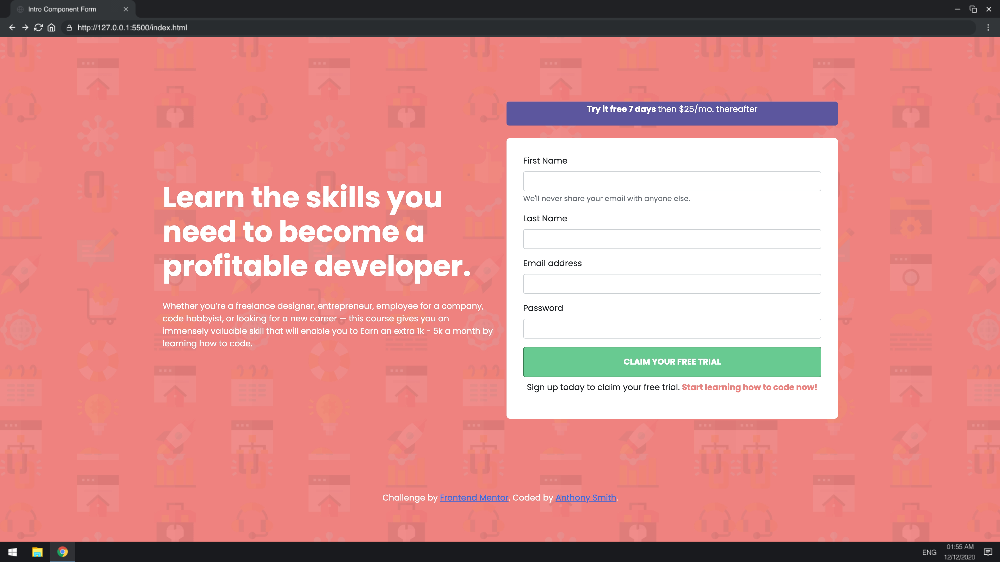

## Learn to Code Form Validator

Simple client side form validation. Check required, length, email and password match.

## Project Specifications

- Create form UI
- Show error messages under specific inputs
- checkRequired() to accept array of inputs
- checkLength() to check min and max length
- checkEmail() to validate email with regex
- checkPasswordsMatch() to match confirm password

## Steps to execute this Form:
- Download the entire code 
- Open up the index.html.
- [View Live Form](https://anthonys1760.github.io/Intro-Form/)

## Technologies used: 
- HTML
- CSS [style/Presentation]
- Javascript [Logic/Working of form]
